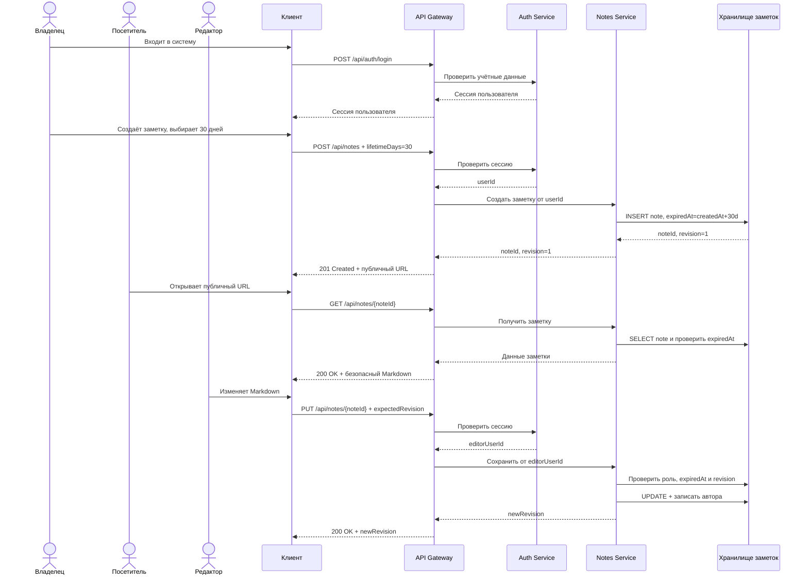
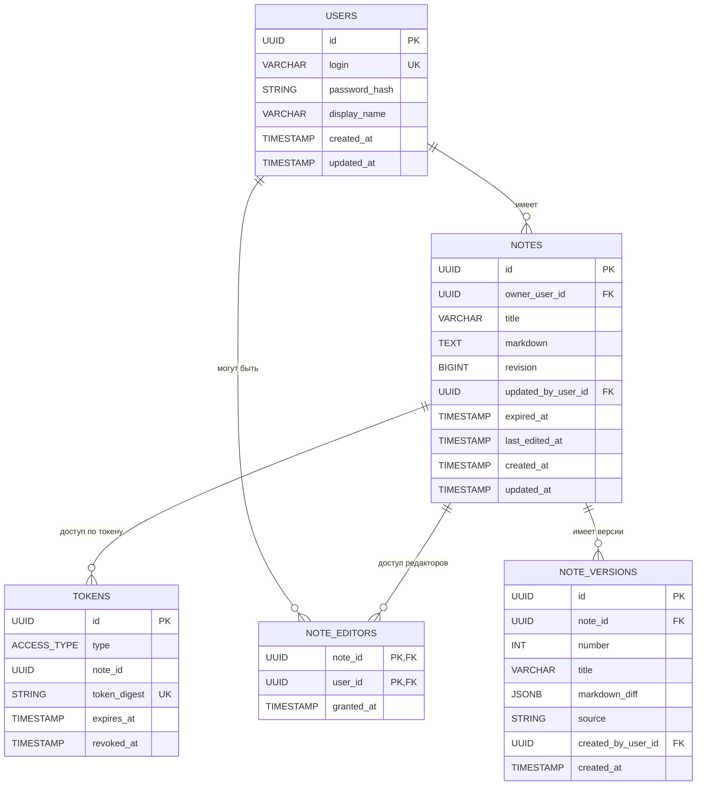

# План реализации проекта Markdown Notes

### Распределение ролей

Артем Ланец: frontend
Николай Грачев: teamlead
Александр Иванов: backend
Семен Малямов: тестировщик

## 1. Назначение проекта

Markdown Notes — учебное веб-приложение для публикации и совместного редактирования заметок в формате Markdown. Пользователь создаёт заметку, отправляет публичную ссылку для просмотра и при необходимости предоставляет зарегистрированным участникам право редактирования.

Просмотр заметки доступен без регистрации и авторизации. Создание, редактирование, управление доступом, просмотр истории, восстановление версий и удаление требуют авторизации. Благодаря этому каждое изменение связано с конкретным пользователем.

При создании заметки пользователь обязательно выбирает срок жизни: 7, 30 или 90 дней. На основе выбранного значения система вычисляет поле `expiredAt`. После наступления этого момента заметка становится недоступной.

Проект разрабатывается как учебный MVP и запускается локально. Конкретные языки программирования, фреймворки и СУБД команда выбирает отдельно по договорённости.

## 2. Границы MVP

В первую версию входят:

- регистрация, вход, выход и управление профилем пользователя;
- создание заметки только авторизованным пользователем;
- обязательный выбор срока жизни: 7, 30 или 90 дней;
- публичный просмотр заметки без авторизации;
- редактирование только авторизованными пользователями с соответствующим правом;
- роли владельца и редактора;
- полноэкранный Markdown-редактор и безопасный режим просмотра;
- автосохранение с защитой от конфликтов;
- история версий с указанием автора изменений;
- управление списком редакторов;
- удаление и автоматическое истечение срока жизни заметки.

В первую версию не входят:

- вход через внешние сервисы;
- восстановление пароля по электронной почте;
- загрузка изображений и других файлов;
- предложения правок от неавторизованных читателей;
- совместное редактирование в реальном времени;
- полнотекстовый поиск;
- изменение срока жизни уже созданной заметки;
- публичное production-развёртывание.

## 3. Пользователи и права доступа

### Неавторизованный посетитель

Может открыть активную заметку по публичной ссылке и увидеть безопасно отрисованный Markdown. Не видит редактор, историю версий и элементы управления.

### Владелец (`OWNER`)

Авторизованный пользователь, создавший заметку. Может просматривать и редактировать её, открывать историю, восстанавливать версии, добавлять и удалять редакторов, а также удалить заметку.

### Редактор (`EDITOR`)

Авторизованный пользователь, которому владелец предоставил доступ. Может просматривать и изменять название и Markdown-текст. Не может управлять доступом, восстанавливать версии или удалять заметку.

Роль читателя в базе не хранится: чтение является публичным. Для каждой операции изменения система проверяет пользовательскую сессию и права на конкретную заметку.

## 4. Архитектура

Система состоит из клиентского приложения, публичного API, сервиса аутентификации и авторизации и сервиса заметок. Технологии реализации в этом документе намеренно не фиксируются.

### Клиентское приложение

Отвечает за регистрацию и вход, создание заметки, полноэкранный редактор, публичный просмотр, автосохранение и отображение состояния запроса: «Сохранение…», «Сохранено» или «Не сохранено».

### API Gateway

Является единственной публичной точкой входа в backend. Маршрутизирует запросы, ограничивает их частоту, передаёт идентификатор запроса и проверенные данные пользователя внутренним сервисам.

### Auth Service

Отвечает за аутентификацию, пользовательские сессии и CRUD профилей:

- создаёт пользователя при регистрации;
- возвращает профиль текущего пользователя;
- обновляет разрешённые поля профиля;
- удаляет учётную запись после повторного подтверждения;
- выполняет вход, обновление сессии и выход;
- проверяет сессию и возвращает неизменяемый `userId` для аудита.

Пароли хранятся только в виде стойкого хэша. Сервис заметок не получает и не хранит пароль, а доверяет проверенной идентичности пользователя, переданной через внутренний контракт.

### Notes Service

Отвечает за CRUD заметок, права редакторов и историю:

- создаёт заметки и вычисляет `expiredAt`;
- публично возвращает активную заметку для чтения;
- проверяет право авторизованного пользователя на изменение;
- сохраняет изменения и идентификатор их автора;
- управляет редакторами;
- создаёт и восстанавливает исторические версии;
- удаляет заметки и скрывает истёкшие.

### Хранилища данных

Логически данные разделены:

- хранилище авторизации содержит пользователей и сессии;
- хранилище заметок содержит заметки, редакторов и версии.

Прямой доступ клиента к сервисам и хранилищам данных не допускается.

## 5. Жизненный цикл заметки

При создании клиент передаёт `lifetimeDays` со значением `7`, `30` или `90`. Сервер не принимает произвольную дату от клиента и сам вычисляет:

```text
expiredAt = createdAt + lifetimeDays
```

Все вычисления и хранение времени выполняются в UTC. Поле `expiredAt` нельзя изменить в рамках MVP.

До наступления `expiredAt` заметка доступна по публичному адресу вида:

```text
http://localhost:3000/notes/550e8400-e29b-41d4-a716-446655440000
```

После наступления `expiredAt` чтение и любые изменения блокируются ответом `410 Gone`. Фоновая задача позднее физически удаляет заметку, её версии и записи редакторов. Для MVP допустима задержка физического удаления до 24 часов: логическая проверка срока выполняется при каждом запросе и не зависит от запуска фоновой задачи.

## 6. Редактор, аудит и сохранение

Основную часть страницы занимает поле Markdown. Авторизованный пользователь видит редактор только при наличии роли `OWNER` или `EDITOR`. Остальные посетители видят только режим просмотра.

После прекращения ввода запускается debounce-таймер. Если в течение двух секунд новых изменений нет, клиент отправляет данные на сервер. Каждый новый символ перезапускает таймер.

Клиент передаёт `expectedRevision`. Обновление выполняется атомарно, только если значение совпадает с текущим `revision`. При несовпадении сервер возвращает `409 Conflict` и не перезаписывает чужие изменения.

Для каждого успешного изменения сохраняются:

- `updatedByUserId` — пользователь, выполнивший последнее изменение;
- `updatedAt` — время изменения;
- новая историческая версия по правилам формирования истории;
- `createdByUserId` у исторической версии.

Автосохранение не создаёт отдельную историческую версию на каждый запрос. Если заметку не изменяли 10 минут, сеанс редактирования считается завершённым. При первой правке следующего сеанса предыдущее состояние сохраняется в историю. Первоначальное состояние также является версией. Перед восстановлением старой версии текущее состояние сохраняется отдельным снимком, а автором операции считается владелец, запустивший восстановление.

## 7. Функциональные требования

**FR-1. Регистрация.** Пользователь должен иметь возможность создать учётную запись с уникальным идентификатором входа и паролем.

**FR-2. Управление сессией.** Пользователь должен иметь возможность войти, обновить сессию и выйти. Операции изменения заметок без действующей сессии отклоняются.

**FR-3. CRUD профиля.** Auth Service должен поддерживать создание профиля при регистрации, чтение и обновление собственного профиля и удаление учётной записи после явного подтверждения.

**FR-4. Создание заметки.** Только авторизованный пользователь может создать заметку. Он указывает название, Markdown-текст и обязательно выбирает срок жизни 7, 30 или 90 дней. Создатель становится владельцем.

**FR-5. Срок жизни.** Сервер вычисляет и сохраняет `expiredAt`. Произвольные и отсутствующие значения срока отклоняются. Срок нельзя изменить после создания.

**FR-6. Публичный просмотр.** Любой пользователь может открыть неистёкшую заметку по её публичному идентификатору без авторизации.

**FR-7. Ограничение редактирования.** Изменять заметку может только авторизованный владелец или редактор. Сервер не полагается только на скрытие кнопок в интерфейсе и проверяет права при каждом запросе.

**FR-8. Управление редакторами.** Владелец может добавить зарегистрированного пользователя в список редакторов и удалить его из списка. Изменение доступа действует немедленно.

**FR-9. Полноэкранный редактор.** Основную часть экрана занимает поле Markdown. Интерфейс позволяет переключаться между исходным текстом и результатом.

**FR-10. Поддержка Markdown.** Поддерживается GitHub Flavored Markdown. Произвольный HTML отключён. Внешние изображения разрешены только по HTTPS.

**FR-11. Автосохранение.** Изменения автоматически отправляются через две секунды после прекращения ввода. Интерфейс отображает состояние сохранения.

**FR-12. Защита от конфликтов.** При сохранении клиент передаёт ожидаемый номер ревизии. Устаревшее значение приводит к `409 Conflict` без потери актуальных данных.

**FR-13. Аудит изменений.** Каждое сохранённое изменение и каждая историческая версия должны быть связаны с `userId` авторизованного пользователя, выполнившего операцию.

**FR-14. История версий.** Владелец просматривает историю с датой и автором изменения и может восстановить выбранную версию.

**FR-15. Ограничение размера.** Размер Markdown-текста одной заметки не превышает 1 МБ.

**FR-16. Истечение срока.** После `expiredAt` просмотр, редактирование, восстановление и управление доступом запрещены. API возвращает `410 Gone`.

**FR-17. Удаление заметки.** Владелец может безвозвратно удалить заметку после явного подтверждения. Вместе с ней удаляются версии и права редакторов.

**FR-18. Работа при временной ошибке.** Если автосохранение не удалось, введённый текст остаётся в браузере, а интерфейс позволяет повторить отправку.

**FR-19. Ограничение запросов.** Gateway ограничивает частоту регистрации, входа, создания заметок и операций записи.

## 8. Нефункциональные требования

**NFR-1. Безопасность учётных данных.** Пароли хранятся с использованием предназначенного для паролей алгоритма хэширования с солью. Сессионные токены не записываются в логи.

**NFR-2. Защита сессии.** Сессия имеет ограниченный срок действия, может быть отозвана при выходе и безопасно передаётся клиентом. Для публичного размещения обязателен HTTPS.

**NFR-3. Защита от XSS.** Рендерер не выполняет HTML и JavaScript из заметки. Опасные URL-схемы блокируются.

**NFR-4. Авторизация на сервере.** Каждая операция записи проверяет сессию, роль пользователя и `expiredAt` на серверной стороне.

**NFR-5. Целостность изменений.** Проверка `expectedRevision`, фиксация автора, создание снимка истории и обновление заметки выполняются атомарно.

**NFR-6. Производительность.** При локальном запуске чтение заметки и обычное автосохранение обрабатываются не дольше 500 мс без учёта debounce.

**NFR-7. Понятные ошибки.** Интерфейс различает отсутствие авторизации, недостаточные права, истечение срока, конфликт изменений, превышение размера и временную ошибку.

**NFR-8. Совместимость.** Клиент работает в актуальных версиях Chrome, Firefox, Safari и Edge и остаётся пригодным для планшета и смартфона.

**NFR-9. Технологическая независимость.** Языки, фреймворки и конкретные СУБД фиксируются отдельным решением команды. Контракты сервисов не должны зависеть от деталей реализации.

**NFR-10. Тестируемость.** Критичная логика сессий, прав доступа, срока жизни, конфликтов, аудита и удаления покрывается модульными и интеграционными тестами не менее чем на 70%.

**NFR-11. Наблюдаемость.** Сервисы ведут структурированные логи с идентификатором запроса и `userId` для авторизованных операций. Пароли, токены сессии и полный текст заметок в логи не записываются.

## 9. Основные API-операции

### Auth Service

| Метод и путь | Назначение | Доступ |
| --- | --- | --- |
| `POST /api/auth/register` | Создать пользователя | Публичный |
| `POST /api/auth/login` | Создать сессию | Публичный |
| `POST /api/auth/refresh` | Обновить сессию | По refresh-сессии |
| `POST /api/auth/logout` | Завершить сессию | Авторизованный |
| `GET /api/users/me` | Получить свой профиль | Авторизованный |
| `PATCH /api/users/me` | Обновить свой профиль | Авторизованный |
| `DELETE /api/users/me` | Удалить учётную запись | Авторизованный |

### Notes Service

| Метод и путь | Назначение | Доступ |
| --- | --- | --- |
| `POST /api/notes` | Создать заметку | Авторизованный |
| `GET /api/notes/{noteId}` | Просмотреть активную заметку | Публичный |
| `PUT /api/notes/{noteId}` | Обновить заметку | `OWNER`, `EDITOR` |
| `DELETE /api/notes/{noteId}` | Удалить заметку | `OWNER` |
| `GET /api/notes/{noteId}/versions` | Получить историю | `OWNER` |
| `POST /api/notes/{noteId}/versions/{versionId}/restore` | Восстановить версию | `OWNER` |
| `POST /api/notes/{noteId}/editors` | Добавить редактора | `OWNER` |
| `DELETE /api/notes/{noteId}/editors/{userId}` | Удалить редактора | `OWNER` |

## 10. Коды ошибок API

| Код | Ситуация |
| --- | --- |
| `400 Bad Request` | Не выбран допустимый срок жизни либо запрос имеет неверный формат |
| `401 Unauthorized` | Для операции изменения отсутствует действующая сессия |
| `403 Forbidden` | Пользователь авторизован, но не имеет требуемых прав |
| `404 Not Found` | Пользователь, заметка или версия не существует |
| `409 Conflict` | Устарел `expectedRevision` либо идентификатор пользователя уже занят |
| `410 Gone` | Срок жизни заметки истёк |
| `413 Payload Too Large` | Markdown превышает 1 МБ |
| `422 Unprocessable Entity` | Данные не прошли проверку |
| `429 Too Many Requests` | Превышен лимит запросов |
| `503 Service Unavailable` | Внутренний сервис временно недоступен |

## 11. Sequence-диаграмма



## 12. ERD-диаграмма

Связи между пользователями и данными заметок являются логическими, если сервисы используют отдельные хранилища.



## 13. Основные критерии готовности MVP

1. Пользователь регистрируется, входит, читает и обновляет свой профиль и может удалить учётную запись.
2. Неавторизованный посетитель открывает активную заметку по публичной ссылке.
3. Создать или изменить заметку без действующей сессии невозможно.
4. При создании обязательно выбирается срок 7, 30 или 90 дней, а сервер корректно вычисляет `expiredAt`.
5. После `expiredAt` заметка немедленно возвращает `410 Gone`, даже если фоновое удаление ещё не выполнялось.
6. Владелец добавляет и удаляет редакторов, а изменение прав применяется немедленно.
7. В истории отображаются дата и пользователь, внёсший изменение.
8. Автосохранение выполняется через две секунды после прекращения ввода.
9. Одновременные изменения приводят к `409 Conflict`, а не к потере данных.
10. HTML и опасный JavaScript из заметки не выполняются.
11. Языки и фреймворки не зафиксированы в плане и выбираются командой отдельно.
