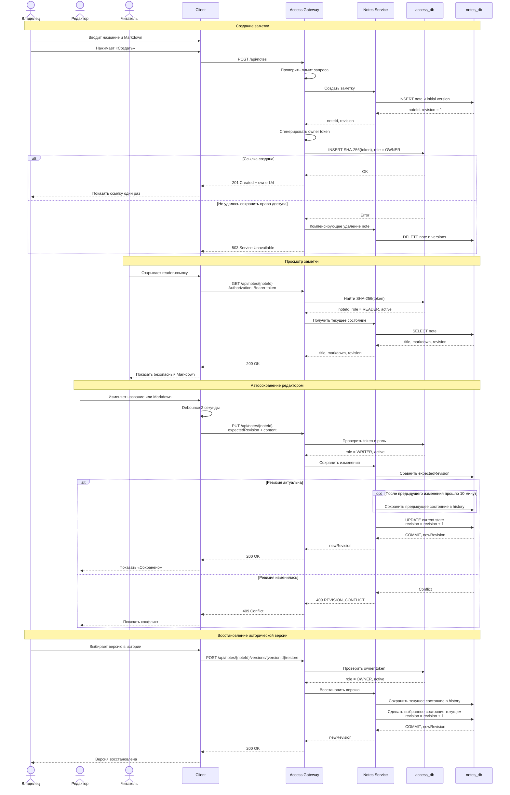
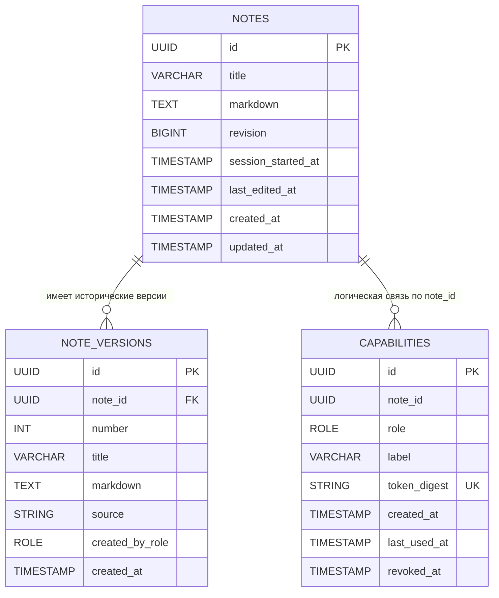
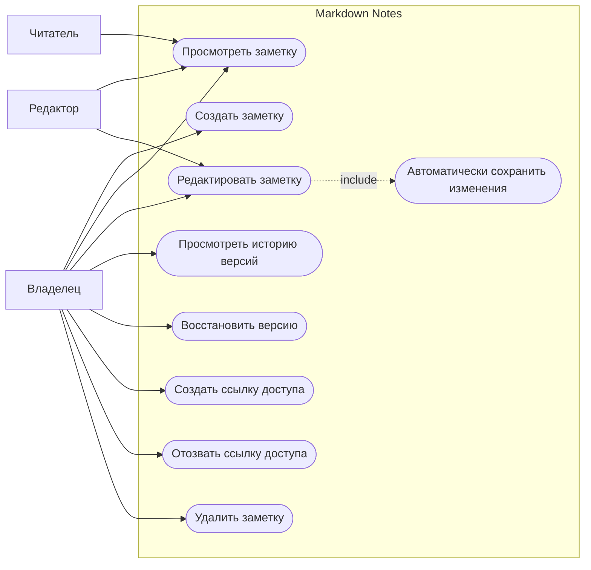

# Отчёт по проекту Markdown Notes

## 1. Назначение проекта

Markdown Notes — учебное веб-приложение для публикации и совместного редактирования заметок в формате Markdown. Оно решает простую практическую проблему: большой текст или фрагмент кода неудобно отправлять через мессенджер, потому что форматирование может потеряться. Вместо этого пользователь создаёт заметку на сайте и отправляет другим людям ссылку с нужным уровнем доступа.

Регистрация в системе не нужна. Право доступа определяется секретной частью ссылки. Создатель заметки становится её владельцем и получает `OWNER`-ссылку. Через неё он может создавать отдельные ссылки для редакторов и читателей, отзывать их, просматривать историю изменений и удалять заметку.

Проект разрабатывается как учебный MVP и запускается локально. Публичное production-развёртывание, собственный домен и CAPTCHA в текущую версию не входят.

## 2. Границы MVP

В первую версию входят:

- создание заметки без регистрации;
- отдельное название и Markdown-текст;
- полноэкранный редактор;
- безопасный просмотр GitHub Flavored Markdown;
- роли `OWNER`, `WRITER` и `READER`;
- несколько независимых ссылок одной роли;
- автосохранение с защитой от конфликтов;
- компактная история версий по сеансам редактирования;
- отзыв ссылок и безвозвратное удаление заметки.

В первую версию не входят:

- аккаунты и восстановление доступа;
- загрузка изображений и других файлов;
- предложения правок от читателей;
- совместное редактирование в реальном времени;
- поиск по заметкам и список «Мои заметки»;
- CAPTCHA;
- интеграция с GitHub Pages или другим production-хостингом.

## 3. Роли и права доступа

Роль хранится как перечисление `Role` с фиксированными значениями `OWNER`, `WRITER` и `READER`.

### Владелец (`OWNER`)

Владелец создаёт заметку и обладает полными правами на неё. Он может читать и редактировать текст, просматривать историю, восстанавливать старые версии, создавать и отзывать ссылки, а также безвозвратно удалить заметку.

### Редактор (`WRITER`)

Редактор может открыть заметку, перейти в режим редактирования и напрямую изменить название или Markdown-текст. Он не может управлять ссылками, просматривать историю версий, восстанавливать версии и удалять заметку.

### Читатель (`READER`)

Читатель видит только отформатированное содержимое заметки. Он не может открыть редактор, получить элементы управления владельца или изменить данные.

## 4. Архитектура

Система состоит из клиентского приложения и двух backend-сервисов.

### React-клиент

React отвечает за полноэкранный редактор, режим просмотра, автосохранение и отображение состояния запроса: «Сохранение…», «Сохранено» или «Не сохранено». Клиент получает секретный токен из фрагмента URL и передаёт его Gateway в заголовке `Authorization: Bearer`.

### Access Gateway на Go

Go-сервис является единственной публичной точкой входа в backend. Он:

- создаёт секретные ссылки;
- хранит и проверяет хэши токенов;
- определяет роль пользователя;
- проверяет право на операцию;
- ограничивает частоту запросов;
- перенаправляет разрешённые запросы в Notes Service.

### Notes Service на Java

Java-сервис отвечает за заметки и их историю. Он:

- создаёт и удаляет заметки;
- возвращает текущее содержимое;
- выполняет автосохранение;
- обнаруживает конфликт параллельных изменений;
- создаёт исторические версии;
- восстанавливает выбранную версию.

### Базы данных

Сервисы используют отдельные базы:

- `notes_db` содержит заметки и историю версий;
- `access_db` содержит роли и SHA-256-хэши секретных токенов.

Прямой доступ клиента к Java-сервису и базам данных не допускается.

## 5. Модель секретных ссылок

Для каждой ссылки Access Gateway генерирует криптографически случайный токен длиной не менее 256 бит. Роль не передаётся в адресе, поэтому пользователь не может заменить `READER` на `OWNER` и получить дополнительные права.

Пример ссылки:

```text
http://localhost:3000/note/550e8400-e29b-41d4-a716-446655440000#token=a8Kf92mQx7...
```

Фрагмент после `#` не отправляется браузером в HTTP-запросах и не попадает в обычные серверные логи или заголовок `Referer`. React извлекает токен и передаёт его API через заголовок авторизации.

В `access_db` сохраняется только `SHA-256`-хэш токена. Полная ссылка показывается один раз сразу после создания. Если пользователь потерял ссылку, восстановить её нельзя: владелец должен отозвать старую запись и создать новую.

У одной заметки может быть несколько ссылок `WRITER` и `READER`. При создании каждой ссылки владелец может указать необязательное название, например «Саша» или «Учебная группа».

Если потеряна `OWNER`-ссылка, восстановить управление заметкой невозможно. Система должна явно предупредить об этом создателя.

## 6. Редактор и сохранение

Основную часть страницы занимает большое поле Markdown. Компактные кнопки действий владельца расположены справа сверху. Пользователь переключается между режимами «Редактор» и «Просмотр» без перехода на другую страницу.

После прекращения ввода запускается debounce-таймер. Если в течение двух секунд новых изменений нет, клиент отправляет данные на сервер. Каждый новый символ перезапускает таймер, поэтому непрерывный ввод не создаёт лишние запросы.

Автосохранение и история версий разделены:

- `revision` — технический номер текущего состояния, который увеличивается после каждого успешного автосохранения;
- `version` — сохранённый снимок для истории, понятный пользователю.

Автосохранение не создаёт новую историческую версию. Если заметку не изменяли 10 минут, текущий сеанс редактирования считается завершённым. При первой правке следующего сеанса предыдущее состояние сохраняется в историю. Первоначальное состояние заметки также становится исторической версией. Перед восстановлением старой версии текущее состояние сохраняется отдельным снимком.

Клиент передаёт серверу `expectedRevision`. Обновление выполняется атомарно только в том случае, если значение совпадает с текущим `revision`. При несовпадении сервер возвращает `409 Conflict` и не перезаписывает чужие изменения.

## 7. Функциональные требования

**FR-1. Создание заметки без регистрации.** Пользователь должен иметь возможность указать название, ввести Markdown-текст и создать заметку без аккаунта. После создания система должна показать `OWNER`-ссылку и предупредить, что восстановить её невозможно.

**FR-2. Полноэкранный редактор.** Основную часть экрана должно занимать поле Markdown. Компактные кнопки управления должны находиться справа сверху и не мешать работе с текстом.

**FR-3. Режим просмотра.** Пользователь должен иметь возможность переключаться между исходным Markdown и отформатированным результатом кнопками «Редактор» и «Просмотр».

**FR-4. Поддержка Markdown.** Система должна поддерживать GitHub Flavored Markdown: заголовки, списки, ссылки, таблицы, цитаты, списки задач, зачёркивание и блоки кода с подсветкой синтаксиса. Произвольный HTML должен быть отключён.

**FR-5. Внешние изображения.** В заметку можно вставлять изображения по внешним HTTPS-ссылкам. Загрузка и хранение изображений или других файлов системой не поддерживаются.

**FR-6. Автосохранение.** Изменения названия и текста должны автоматически отправляться на сервер через две секунды после прекращения ввода. В интерфейсе должно отображаться состояние сохранения.

**FR-7. Защита от конфликтов.** При сохранении клиент должен передавать ожидаемый номер ревизии. Если заметка уже изменена другим редактором, сервер должен вернуть `409 Conflict`, не перезаписывая актуальные данные.

**FR-8. История версий.** Первоначальное состояние и состояния между сеансами редактирования должны сохраняться в истории. Новый сеанс начинается после перерыва в изменениях продолжительностью не менее 10 минут.

**FR-9. Восстановление версии.** Владелец должен иметь возможность просмотреть историю и восстановить выбранную версию. Перед восстановлением текущее состояние сохраняется в истории. Восстановленное состояние становится началом нового сеанса.

**FR-10. Роли доступа.** Система должна хранить роль как перечисление `Role` с допустимыми значениями `OWNER`, `WRITER` и `READER`. Права каждой роли описаны в разделе 3. Произвольное строковое значение роли не допускается.

**FR-11. Создание ссылок.** Владелец должен иметь возможность создавать любое количество независимых ссылок `WRITER` и `READER`, задавая каждой необязательное название.

**FR-12. Однократный показ ссылки.** Полная секретная ссылка должна показываться только сразу после создания. Позднее владелец видит роль, название, дату создания, последнее использование и состояние ссылки, но не её токен.

**FR-13. Отзыв доступа.** Владелец должен иметь возможность отозвать отдельную ссылку. Отозванная ссылка должна немедленно перестать давать доступ к заметке.

**FR-14. Просмотр читателем.** Пользователь с ролью `READER` должен видеть только безопасно отрисованный Markdown без редактора и административных действий.

**FR-15. Ограничение размера.** Размер Markdown-текста одной заметки не должен превышать 1 МБ. При превышении лимита данные не сохраняются, а пользователь получает понятное сообщение.

**FR-16. Удаление заметки.** Владелец должен иметь возможность безвозвратно удалить заметку после явного подтверждения. Вместе с ней удаляются версии, а все связанные ссылки перестают работать.

**FR-17. Работа при временной ошибке.** Если автосохранение не удалось, введённый текст должен остаться в браузере. Интерфейс показывает ошибку и позволяет повторить отправку после восстановления соединения.

**FR-18. Ограничение запросов.** Gateway должен ограничивать частоту создания заметок и операций записи. CAPTCHA в MVP не используется.

## 8. Нефункциональные требования

**NFR-1. Безопасность токенов.** Токены доступа должны генерироваться криптографически стойким генератором и содержать не менее 256 бит случайных данных. В базе хранится только SHA-256-хэш токена.

**NFR-2. Защита от XSS.** Рендерер не должен выполнять HTML и JavaScript из заметки. Опасные URL-схемы должны блокироваться, а внешние изображения разрешаются только по HTTPS.

**NFR-3. Изоляция сервисов.** Только Access Gateway доступен клиенту. Notes Service и обе базы данных должны быть доступны лишь во внутреннем контуре приложения.

**NFR-4. Целостность изменений.** Проверка `expectedRevision`, сохранение снимка истории и обновление заметки должны выполняться атомарно. Потерянное обновление и молчаливое перезаписывание данных не допускаются.

**NFR-5. Производительность.** При локальном запуске чтение заметки и обычное автосохранение должны обрабатываться не дольше 500 мс без учёта двухсекундного debounce. Переключение между редактором и просмотром должно происходить без перезагрузки страницы.

**NFR-6. Ограничение нагрузки.** Система должна корректно обрабатывать не менее 100 одновременных запросов в тестовом окружении. Ограничение частоты запросов не должно мешать обычному редактированию.

**NFR-7. Надёжность межсервисных операций.** Если после создания заметки не удалось выпустить `OWNER`-ссылку, Gateway должен отправить компенсирующий запрос на удаление недоступной заметки. Временные межсервисные ошибки должны журналироваться.

**NFR-8. Понятные ошибки.** Пользователь не должен видеть stack trace и внутренние детали сервисов. Интерфейс должен различать недействительную ссылку, недостаточные права, конфликт изменений, превышение размера и временную сетевую ошибку.

**NFR-9. Совместимость.** Клиент должен работать в актуальных версиях Chrome, Firefox, Safari и Edge. Интерфейс должен оставаться пригодным для чтения и редактирования на планшете и смартфоне.

**NFR-10. Поддерживаемость.** Ответственность Go- и Java-сервисов должна быть разделена. Публичные API и межсервисные контракты документируются, а критичная логика не дублируется между сервисами.

**NFR-11. Тестируемость.** Критичная логика ролей, токенов, конфликтов, истории и удаления должна быть покрыта модульными и интеграционными тестами не менее чем на 70%. Основные пользовательские сценарии проверяются end-to-end тестами.

**NFR-12. Наблюдаемость.** Сервисы должны вести структурированные логи с идентификатором запроса. Секретные токены и полный текст заметок в логи не записываются.

**NFR-13. Учебное окружение.** Система должна запускаться локально по документированной команде. Для локального запуска допускается HTTP; при будущем публичном размещении потребуется HTTPS с TLS 1.2 или выше.

## 9. Коды ошибок API

| Код | Ситуация |
| --- | --- |
| `401 Unauthorized` | Токен отсутствует или имеет неверный формат |
| `403 Forbidden` | Роль не разрешает запрошенную операцию |
| `404 Not Found` | Заметка не существует, удалена либо ссылка отозвана |
| `409 Conflict` | Переданный `expectedRevision` устарел |
| `413 Payload Too Large` | Markdown превышает 1 МБ |
| `422 Unprocessable Entity` | Название или содержимое не прошло проверку |
| `429 Too Many Requests` | Превышен лимит запросов |
| `503 Service Unavailable` | Один из backend-сервисов временно недоступен |

## 10. Sequence-диаграмма



## 11. ERD-диаграмма

Таблицы `NOTES` и `NOTE_VERSIONS` находятся в `notes_db`, а `CAPABILITIES` — в отдельной `access_db`. Поэтому связь с `CAPABILITIES` является логической и не реализуется внешним ключом между базами.



Поле `source` у версии принимает значения `initial`, `session` или `restore`. Поле `created_by_role` показывает, кем было сформировано состояние: владельцем, редактором или самой системой при восстановлении.

## 12. Use Case-диаграмма



## 13. Основные критерии готовности MVP

MVP считается готовым, если выполняются следующие условия:

1. Заметка создаётся без регистрации, а `OWNER`-ссылка позволяет снова открыть её после перезапуска браузера.
2. Владелец создаёт отдельные ссылки `WRITER` и `READER`, копирует их и может отозвать каждую независимо.
3. Изменение роли путём редактирования URL невозможно.
4. Редактор меняет заметку, а читатель не получает элементов редактирования.
5. Автосохранение выполняется через две секунды после прекращения ввода и не создаёт отдельную историческую версию при каждом запросе.
6. Новый снимок истории формируется после десятиминутного перерыва между сеансами.
7. Одновременные изменения приводят к `409 Conflict`, а не к потере данных.
8. Владелец просматривает историю и восстанавливает выбранное состояние.
9. HTML и опасный JavaScript из заметки не выполняются.
10. После удаления заметки все ранее выданные ссылки перестают работать.
